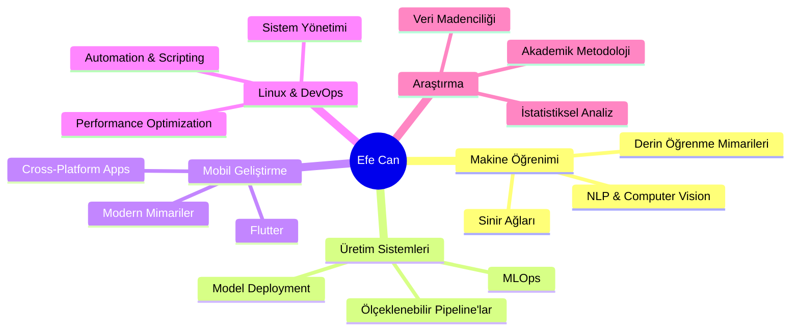

<div align="center">

# 👋 Merhaba, Ben Efe Can Kara

### 🔬 Veri Bilimci | 🤖 Makine Öğrenimi Mühendisi | 📱 Mobil Geliştirici | 🐧 Linux Uzmanı

*Verileri içgörülere, fikirleri gerçeğe dönüştüren bir problem çözücü*

[](https://www.linkedin.com/in/karsterr/)
[](mailto:kr.efecan@gmail.com)
[](https://github.com/karsterr)
[](https://goo.gl/maps/Turkey)


</div>

---

## 🎯 Hakkımda

🎓 **Sivas Cumhuriyet Üniversitesi** Bilişim Sistemleri ve Teknolojileri bölümü 4. sınıf öğrencisiyim.

💼 **İş birliğine açığım** - Veri bilimi projeleri, yapay zeka çözümleri ve yenilikçi mobil uygulamalar üzerinde çalışmaya hazırım.

🚀 Gerçek dünya problemlerini çözen **veri odaklı çözümler** geliştirmeye tutkuyla bağlıyım. Tahmine dayalı analitik ve veri madenciliğinden, üretim aşamasına hazır mobil uygulamalara kadar geniş bir yelpazede deneyim sahibiyim.

🐧 **7+ yıllık Linux tecrübesi** ile sistem yönetimi, kabuk scripting, paket yönetimi ve performans optimizasyonu konularında derinlemesine bilgi sahibiyim. Çeşitli dağıtımları aktif olarak kullanıyor ve test ediyorum.

💡 **Felsefem**: Temiz, sürdürülebilir ve anlamlı kod yazıyorum - sadece çalışan değil, hikâye anlatan kod. Her proje, öğrenmek ve topluluğa katkıda bulunmak için bir fırsattır.

---

## 🛠️ Teknoloji Yığınım

### 🤖 Veri Bilimi & Yapay Zeka
```python
technologies = {
    "Languages": ["Python", "R"],
    "ML/DL": ["TensorFlow", "PyTorch", "Scikit-learn", "Keras"],
    "Data Analysis": ["Pandas", "NumPy", "SciPy", "Statsmodels"],
    "Visualization": ["Plotly", "Matplotlib", "Seaborn"],
    "MLOps": ["Docker", "MLflow", "DVC"]
}
```


### 💻 Geliştirme & Sistemler


### 🗄️ Veritabanları & DevOps


---

## 📊 GitHub İstatistiklerim

<div align="center">


</div>

<div align="center">


</div>

---

## 🎯 Şu Anki Odak Noktalarım



- 🔬 **İleri Düzey ML**: Derin öğrenme mimarileri, transformer modeller ve neural network optimizasyonu
- 🚀 **MLOps & Production**: Ölçeklenebilir veri pipeline'ları, model serving ve continuous integration
- 📱 **Mobile Development**: Flutter ile cross-platform uygulamalar ve modern mimari patternleri
- 📈 **Data Science**: İstatistiksel analiz, A/B testing ve predictive analytics
- 🐧 **Linux Mastery**: Sistem yönetimi, shell scripting, containerization ve server optimization

---

## 🏆 GitHub Aktivitesi

<div align="center">


</div>

---

## 💭 Motivasyon

<div align="center">

> *"Basitlik, sofistikasyonun doruk noktasıdır. Veri hikâyeler anlatır, kod ise sorunları çözer."*

### 🌟 İlkelerim

**🎯 Problem Çözme** • **📊 Veri Odaklılık** • **🔄 Sürekli Öğrenme** • **🤝 İşbirliği** • **💡 İnovasyon**

</div>

---

## 🤝 Benimle İletişime Geçin

<div align="center">

### 🚀 Birlikte Harika Projeler Yaratmaya Hazırım!

Veri bilimi, makine öğrenimi, mobil uygulama geliştirme veya Linux tabanlı çözümler konusunda iş birliği yapmak isterseniz, benimle iletişime geçmekten çekinmeyin!

📧 **Email**: [kr.efecan@gmail.com](mailto:kr.efecan@gmail.com)  
💼 **LinkedIn**: [linkedin.com/in/karsterr](https://www.linkedin.com/in/karsterr/)  
🐙 **GitHub**: [@karsterr](https://github.com/karsterr)  
📍 **Konum**: Muğla, Türkiye

---


</div>
